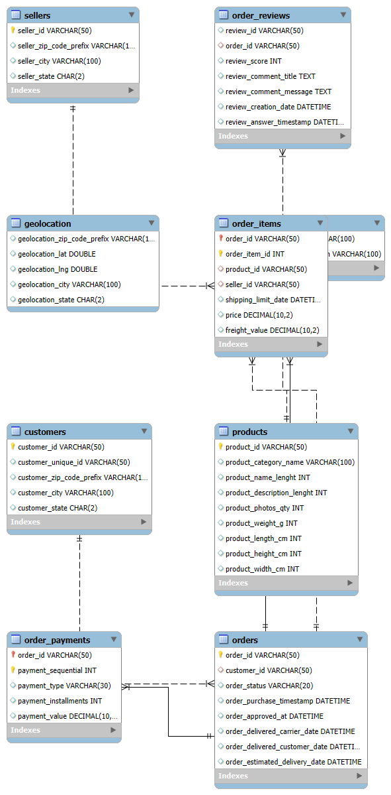
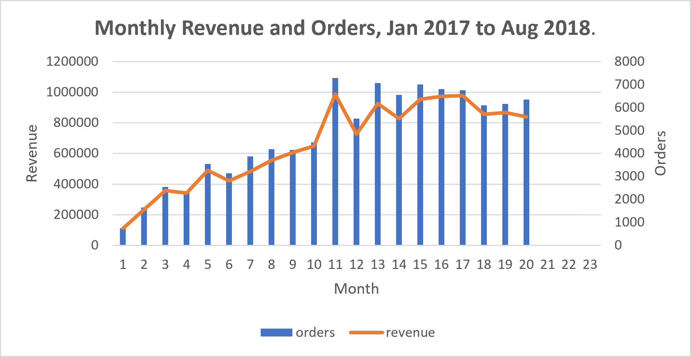
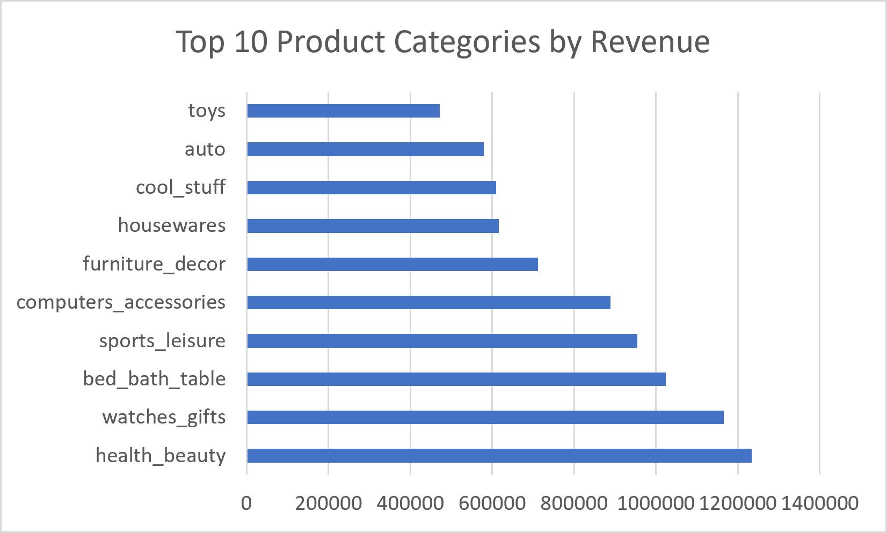
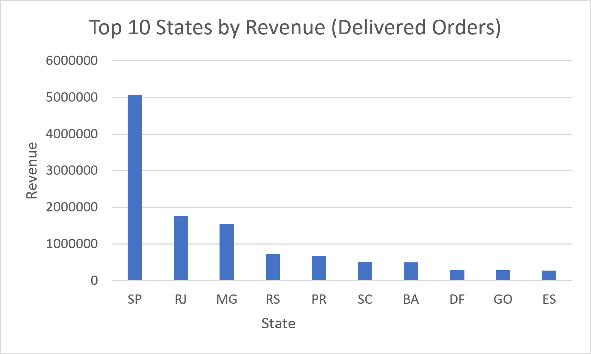
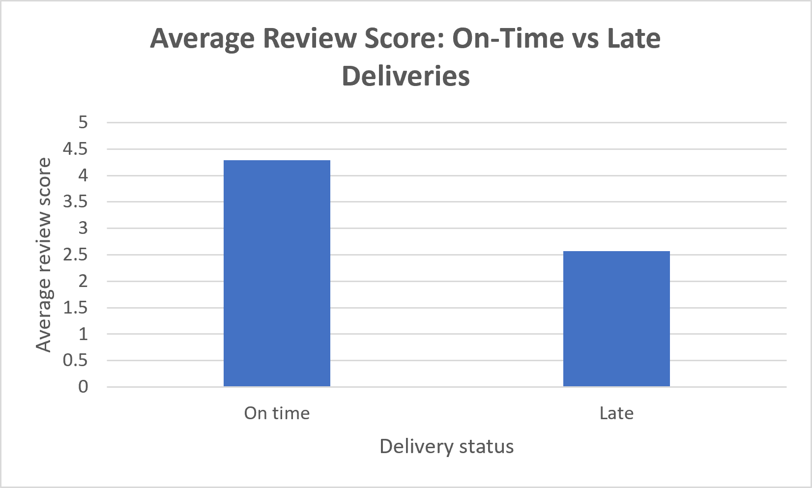
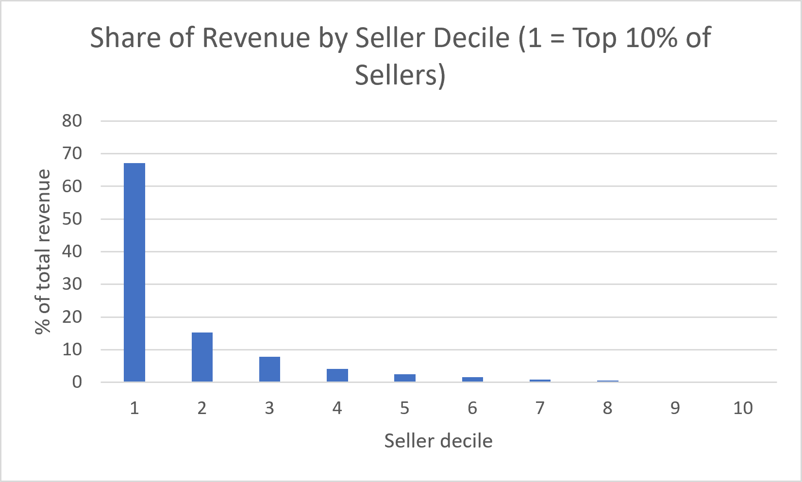
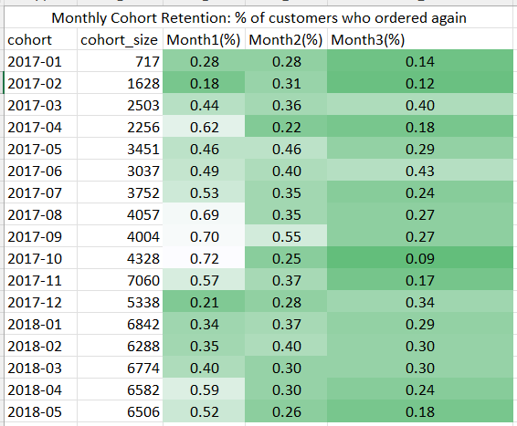
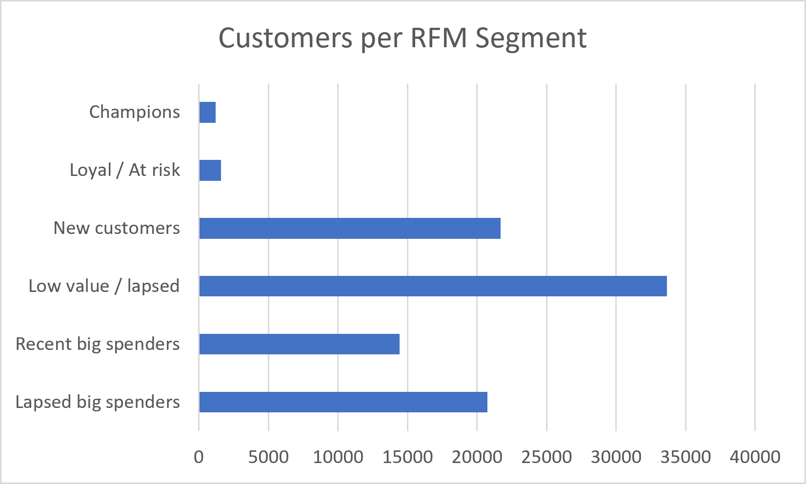

# Olist E-Commerce SQL Analysis

Analysis of 100k Brazilian e-commerce orders (2016-2018) across 9 relational tables,
answering 20 business questions with MySQL (joins, CTEs, window functions).

## Dataset
[Olist Brazilian E-Commerce](https://www.kaggle.com/datasets/olistbr/brazilian-ecommerce) (Kaggle).
Tables: customers, orders, order_items, order_payments, order_reviews, products,
sellers, geolocation, category_translation.

## Tools
MySQL 8.0, MySQL Workbench, Excel (charts)

## Data quality findings
- 97.02% of orders are delivered; revenue analysis uses delivered orders only
- 8 delivered orders lack a delivery date; 0 orders delivered before purchase
- 2 product categories have no English translation (handled with COALESCE)
- 99,441 customer_ids map to 96,096 real customers, so customer_unique_id is used for retention
- Zero-value dates in order_reviews were converted to NULL; no orphan records

## Key findings
1. **Growth:** revenue grew through 2017 via order volume, peaking at Black Friday
   (Nov 2017: 7,289 orders, R$987,765). Average order value stayed flat at R$125-150.
   
2. **Category concentration:** top 10 categories generate ~62% of revenue.
   
3. **Geography:** SP alone is ~38% of revenue; SP, RJ, MG together ~63%.
   
4. **Delivery:** **8.11%** of delivered orders (7,826 of 96,470) arrive after the estimated date.
   Orders take 12.5 days on average against an estimate of 24.4 days, so Olist pads its estimates
   heavily, yet the orders that still miss them score far lower: a review score of **2.57 vs 4.29**
   for on-time orders, a drop of 1.72 points.
   
5. **Sellers:** revenue is highly concentrated. The top 10% of sellers (297 sellers) generate
   **67.1%** of revenue, and the top 20% generate **82.3%**.
   
6. **Retention:** only **3.0%** of customers (2,801 of 93,358) placed a second order. Monthly
   cohort retention is below 1% in every cohort, so growth comes almost entirely from new customers.
   
7. **RFM segments:** customers with high spend (recent and lapsed big spenders) are 38% of
   customers but **71% of revenue**, and average about R$267 each against R$55 for other
   customers. "Lapsed big spenders" alone (20,755 customers) account for **42% of revenue**.
   Only 2,801 customers are repeat buyers (Champions plus Loyal/At risk).
   

## Recommendations
- **Fix delivery reliability:** late orders lose 1.7 review points. Estimates are already
  conservative (24.4 days vs 12.5 actual), so the focus should be on the 8% of orders that miss
  them: monitor seller SLAs and investigate slow seller-state routes (Q20).
- **Win back high-value one-time buyers:** 20,755 lapsed big spenders represent 42% of revenue;
  a post-purchase email or voucher sequence targets the biggest pool
- **Reduce seller dependence:** the top 10% of sellers drive 67% of revenue, so protect them
  and recruit sellers in the top categories
- Plan inventory and seller capacity ahead of November (Black Friday peak)
- Reduce dependence on the southeast via seller recruitment in other regions

## Caveats
Revenue = item price excluding freight, delivered orders only. Aug-Oct 2018 data is incomplete.
RFM "lapsed" is relative to the dataset's time window, and segments are based on recency and spend quintiles.

## How to reproduce
1. Download the dataset from Kaggle
2. Run `01_schema/create_tables.sql`
3. Edit the file paths in `01_schema/load_data.sql`, then run it from the mysql client with `--local-infile=1`
4. Run the scripts in `02_data_quality/`, `03_analysis/`, `04_views/`